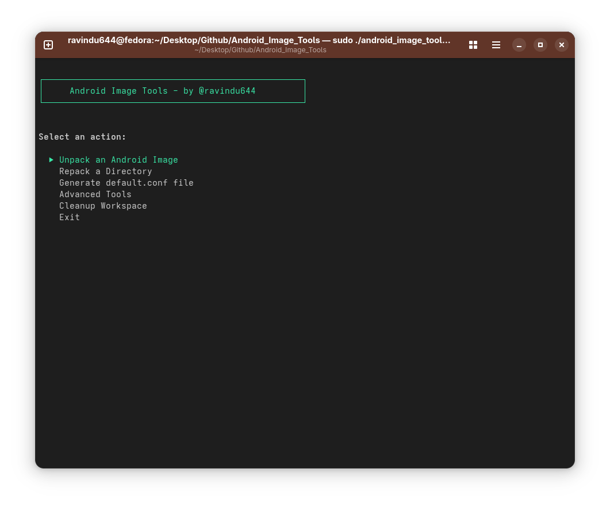

# Android Image Tools 🛠️

[](https://github.com/ravindu644/Android_Image_Tools/releases)
[](https://opensource.org/licenses/MIT)

A powerful, user-friendly Linux script for unpacking and repacking Android images with full filesystem support, SELinux context preservation, and seamless automation. Like CRB Kitchen, but native to Linux with cross-distro compatibility and advanced CI/CD features.

<details>
<summary><strong>Click here to preview the interface</strong></summary>



</details>

## ✨ What It Does

- **Unpack Android Images**: Extract partitions from `.img` files to editable directories
- **Modify Files**: Edit system files, apps, configurations, etc.
- **Repack Images**: Rebuild bootable Android images with your changes
- **Super Image Support**: Handle complex multi-partition `super.img` files
- **Filesystem Conversion**: Convert between ext4, EROFS, and F2FS formats
- **SELinux Preservation**: Maintain security contexts for bootable images
- **Automation Ready**: Generate configs automatically for CI/CD pipelines

## 🚀 Quick Start

### Basic Usage

```bash
# Interactive mode
sudo ./android_image_tools.sh

# Automated mode with config
sudo ./android_image_tools.sh --conf=config.conf
```

### Simple Workflow

1. Place your `.img` file in `INPUT_IMAGES/`
2. Run the tool and select "Unpack an Android Image"
3. Edit files in the extracted directory
4. Select "Repack a Directory" to rebuild
5. Find your new image in `REPACKED_IMAGES/`

## 📋 Features

| Feature | Description |
|---------|-------------|
| **Open Source** | Free, transparent, and community-driven |
| **Cross-Distro Compatible** | Ubuntu/Debian + Fedora/RHEL |
| **Filesystem Support** | ext4, EROFS, F2FS |
| **SELinux Preservation** | Maintains Android security contexts |
| **Interactive GUI** | Easy terminal menu interface |
| **Auto Config Generation** | No manual config creation needed |
| **CI/CD Ready** | Full automation support |
| **Super Image Handling** | Multi-partition Android images |
| **Compression Options** | LZ4, LZ4HC, Deflate algorithms |
| **Filesystem Conversion** | Convert between any supported formats |
| **Sparse Image Support** | Automatic format handling |
| **Smart Cleanup** | Automatic temp file management |

### Prerequisites
- **Root access** (sudo required)
- **Architecture**: x86_64 (AMD64) based system required
- **Supported Distributions**: Ubuntu/Debian-based or Fedora/RHEL-based Linux distributions
- **Linux kernel** with loop device support *(preferred method, provides best performance and SELinux compatibility)*
- **FUSE support** (fallback option for restricted environments, but buggy/limited in SELinux environments)

*Required packages are installed automatically*

## 📖 Detailed Usage

### Main Menu Options

- **Unpack an Android Image**: Extract single partition images
- **Repack a Directory**: Rebuild images from extracted folders
- **Generate Config File**: Create automation templates
- **Advanced Tools**: Super image operations
- **Cleanup Workspace**: Remove temporary files

### Automation Setup

The tool eliminates manual config creation:

#### Method 1: Export During Repacking
```bash
sudo ./android_image_tools.sh
# Navigate: Repack a Directory → Complete setup → "Export selected settings"
```
Creates a ready-to-use config file automatically.

#### Method 2: Export During Unpacking
```bash
sudo ./android_image_tools.sh
# Navigate: Unpack an Android Image → Complete setup → "Export selected settings"
# Or: Advanced Tools → Super Image Kitchen → Unpack a Super Image → "Export selected settings"
```
Creates reusable config files for automation workflows.

#### Method 3: Super Image Configuration
```bash
sudo ./android_image_tools.sh
# Navigate: Advanced Tools → Super Image Kitchen → Finalize Project Configuration
```
Automatically generates complex multi-partition configs.

#### Using Generated Configs
```bash
# Run automated operations
sudo ./android_image_tools.sh --conf=generated_config.conf
```

### Config File Examples

**Basic Unpacking:**
```ini
ACTION=unpack
INPUT_IMAGE=system.img
EXTRACT_DIR=extracted_system
```

**Super Image Unpacking:**
```ini
ACTION=super_unpack
INPUT_IMAGE=super.img
PROJECT_NAME=my_super_project
```

**Basic Repacking:**
```ini
ACTION=repack
SOURCE_DIR=EXTRACTED_IMAGES/extracted_system
OUTPUT_IMAGE=REPACKED_IMAGES/system_new.img
FILESYSTEM=erofs
COMPRESSION_MODE=lz4hc
COMPRESSION_LEVEL=9
CREATE_SPARSE_IMAGE=true
```

**Super Image Repacking:**
```ini
ACTION=super_repack
PROJECT_NAME=my_super_project
OUTPUT_IMAGE=REPACKED_IMAGES/super_new.img
```

## 📁 Project Structure

```
Android_Image_Tools/
├── android_image_tools.sh    # Main script
├── .bin/                     # Helper scripts
├── INPUT_IMAGES/             # Place .img files here
├── EXTRACTED_IMAGES/         # Unpacked directories
├── REPACKED_IMAGES/          # Output images
├── SUPER_TOOLS/              # Super image projects
├── CONFIGS/                  # Generated configs
└── .tmp/                     # Temp files (auto-cleaned)
```

## 🛠️ Troubleshooting

### Common Issues

**Permission denied**
- Run with `sudo`
- Check file ownership

**SELinux contexts lost**
- Only occurs on SELinux-enforcing distros when using FUSE mounting
- Normal on Fedora (contexts preserved with kernel mounts)
- Use kernel mounts when possible

**Sparse conversion fails**
- Check `simg2img`/`img2simg` installation
- Verify disk space

**Super operations fail**
- Verify `super.img` integrity

### Debug Mode

Enable detailed logging for complex operations:
```bash
# Add to super config
ENABLE_VERBOSE_LOGS=true
```

## 🤝 Contributing

1. Fork the repository
2. Test on Ubuntu + Fedora systems
3. Submit pull requests

## 📄 License

MIT License - see [LICENSE](LICENSE) file.

## 🙏 Credits

Inspired by CRB Kitchen for Windows. Thanks to the Android modding community!

---

**Ready to mod?** 🚀 Run the tool and explore the menu - everything is designed to be intuitive!
